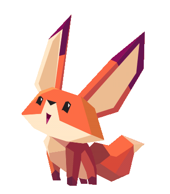

   
  

<h3 align="center">Hola!, Yo soy <a href="https://github.com/lsarantes/lsarantes">Luis J. Sarantes D.</a> </h3>
  

## <picture></picture> About me

<table>
  <tr>
    <!-- Columna de texto -->
    <td valign="middle" style="padding-right: 20px; text-align: left;">

- :school:  Mis estudios fueron realizados en la <a href="https://www.uni.edu.ni/">Universidad Nacional de Ingeniería (UNI)</a>  
- :technologist: <strong>Actualmente he estado trabajando en</strong> <code>FullStack Developer</code> & <code>Data Science</code>  
- :email: Contáctame 

    </td>

    <!-- Columna del GIF -->
    <td valign="middle">
      
    </td>
  </tr>
</table>

<h2 align="center">Frontend</h2>
<table align="center">
  <tr>
    <td align="center">
       html
    </td>
    <td align="center">
       css
    </td>
    <td align="center">
       js
    </td>
    <td align="center">
       ts
    </td>
    <td align="center">
       react
    </td>
  </tr>
</table>

---

<h2 align="center">Backend</h2>
<table align="center">
  <tr>
    <td align="center">
       nodejs
    </td>
    <td align="center">
       python
    </td>
    <td align="center">
       java
    </td>
    <td align="center">
       c#
    </td>
    <td align="center">
       flask
    </td>
    <td align="center">
       nestjs
    </td>
  </tr>
</table>

---

<h2 align="center">Mobile</h2>
<table align="center">
  <tr>
    <td align="center">
       dart
    </td>
    <td align="center">
       flutter
    </td>
    <td align="center">
       react native
    </td>
  </tr>
</table>

---

<h2 align="center">Bases de datos / Data</h2>
<table align="center">
  <tr>
    <td align="center">
       mysql
    </td>
    <td align="center">
       postgres
    </td>
    <td align="center">
       sqlite
    </td>
    <td align="center">
       firebase
    </td>
    <td align="center">
       prisma
    </td>
  </tr>
</table>

---

<h2 align="center">Sistemas / Bajo nivel</h2>
<table align="center">
  <tr>
    <td align="center">
       linux
    </td>
    <td align="center">
       bash
    </td>
  </tr>
</table>

---

<h2 align="center">DevOps / Herramientas</h2>
<table align="center">
  <tr>
    <td align="center">
       git
    </td>
    <td align="center">
       github
    </td>
    <td align="center">
       docker
    </td>
    <td align="center">
       postman
    </td>
    <td align="center">
       vscode
    </td>
    <td align="center">
       figma
    </td>
    <td align="center">
       azure
    </td>
  </tr>
</table>

   

